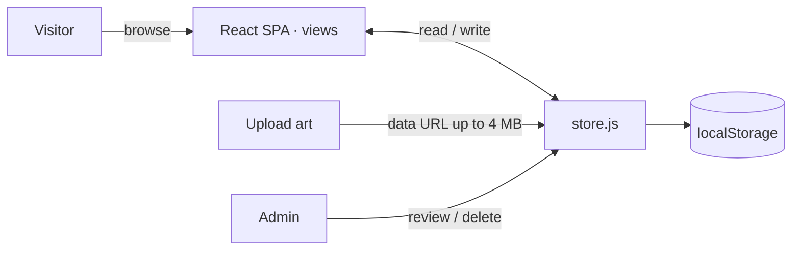

<p align="center">
  
</p>

<h1 align="center">Impressiva Printing</h1>

<p align="center"><b>A bold custom print-shop site with a street / graffiti, liquid-glass aesthetic.</b></p>
<p align="center">
  Front end for <a href="https://impressivaprinting.com">impressivaprinting.com</a>. <em>Print Loud. Print Proud.</em>
</p>

<p align="center">
  
  
  
  
  
</p>

<br />

- **Front end only** — no server. Accounts, sessions, and uploaded artwork all live in the browser via `localStorage`.
- **Full storefront** — animated home, filterable product catalog, work portfolio, quote calculator, and a job tracker.
- **Mock accounts** — customers sign up, upload print-ready art, and manage their files; staff review every upload from an admin view.

## Stack

| Layer | Choice |
|-------|--------|
| Framework | React 19 + React Router 7 |
| Build | Vite 7 |
| Styling | Tailwind CSS 3 |
| Motion / icons | Framer Motion · lucide-react |
| Persistence | Browser `localStorage` (no backend) |
| Hosting | Vercel (SPA rewrites in `vercel.json`) |

## Getting started

```bash
npm install
npm run dev        # Vite dev server
npm run build      # production build
npm run lint       # eslint
npm run format     # prettier --write
```

## Pages

| Route | What it is |
|-------|-----------|
| Home | Hero, product marquee, capabilities, process timeline, testimonials, FAQ |
| Products | Full catalog with category filters |
| Work | Portfolio strip of finished jobs |
| About / Contact | Info pages; contact form is demo-only |
| Login / Signup | Mock auth backed by `localStorage` |
| Account | Customers upload PNG/JPG/WEBP/SVG/GIF art (≤ 4 MB) and manage files |
| Admin | Staff view of every uploaded file across customers, with status + delete |

## How persistence works

There is no backend. A single `store.js` module is the whole data layer — it seeds an
admin, tracks the session, and stores uploads as data URLs, all in `localStorage`.



Because data is per-browser, it clears when the visitor clears site data.

## Demo credentials

An admin is seeded automatically on first load:

```
admin@impressivaprinting.com / admin123
```

Customers create their own accounts via **Sign up**.

## Project structure

```
src/app/
  components/   reusable UI (Nav, Marquee, QuoteCalculator, JobTracker, …)
  views/        pages (Home, Products, Work, Account, Admin, …)
  context/      auth context + provider
  data/store.js localStorage persistence layer
  constants/    site config, product catalog, routes
  utils/        upload validation (type + 4 MB cap)
public/         favicon, release.json
```

## License

Private project — all rights reserved. Made by [TaylorURL](https://taylorurl.com).
